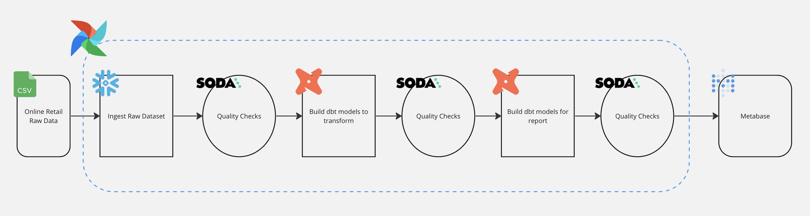

# Data-Engineering-DBT-Airflow
---
## Introduction

Welcome to the Retail Data Pipeline Project. This initiative is dedicated to exploring and demonstrating the construction of a robust data pipeline tailored for retail analytics. Utilizing Apache Airflow and integrating multiple advanced data processing tools and technologies, this project covers a comprehensive workflow from data ingestion to analytics and reporting.

## Tools and Technologies

- **Apache Airflow**: Orchestrates and schedules complex data workflows.
- **Google Cloud Platform (GCP)**: Utilizes services like BigQuery for analytics and Google Cloud Storage for scalable data storage.
- **dbt (Data Build Tool)**: Manages data transformation to build reliable, testable data models.
- **Soda**: Ensures data quality by performing automated checks and validations.
- **Metabase**: Offers intuitive and powerful data visualization for business intelligence.
- **Astro CLI**: Facilitates the local development and testing of Airflow workflows within a Docker environment.
- **Docker**: Ensures consistency across environments by containerizing the application and its dependencies.
- **Git**: Provides version control to manage changes and collaboration in the project.

## Project Details

### Data Ingestion

The project starts with the automated ingestion of data into GCP BigQuery. This step involves setting up DAGs in Airflow to handle the continuous flow of incoming data, ensuring that new data is extracted and loaded into cloud storage without manual intervention.

### Data Quality

Maintaining high data quality is crucial for reliable analytics. Soda is used within the pipeline to implement data quality checks. These checks are automated and configured to trigger alerts or actions if data anomalies or inconsistencies are detected.

### Data Transformation

Using dbt, the project transforms raw data into a structured star schema, optimizing it for analysis and reporting. dbt plays a significant role here, allowing for modular, reusable, and version-controlled transformations that contribute to a cleaner and more maintainable codebase.

### Data Loading and Reporting

After transformation, data is loaded back into BigQuery, where it is ready for analysis. Metabase is then employed to create dynamic dashboards that provide actionable insights, making it easier for stakeholders to make data-driven decisions.

### Technical Considerations

#### Scalability
The integration with cloud services like GCP ensures that the pipeline is scalable and can handle increasing volumes of data without a loss in performance.

#### Modularity
The use of dbt and Airflow allows for modular design, where changes in one part of the pipeline do not necessarily disrupt other operations. This modularity also aids in troubleshooting and iterative development.

#### Automation
From data quality checks with Soda to report generation in Metabase, automation is a key theme, reducing the need for manual intervention and making the pipeline robust and error-resistant.

#### Containerization
Docker not only simplifies the deployment but also aids in creating a consistent development environment that mimics production, reducing the "it works on my machine" syndrome.

## Airflow Dashboard

The Airflow dashboard provides a user-friendly interface for monitoring and managing the data workflows, facilitating easy oversight and management of the pipeline's components.

## Conclusion

This project demonstrates the practical application of integrating multiple data engineering tools to build a comprehensive and robust data pipeline. It showcases the capability to utilize and combine technologies such as Apache Airflow, dbt, Soda, and Metabase effectively, highlighting advanced skills in data orchestration, transformation, quality management, and visualization within a cloud-based architecture.

